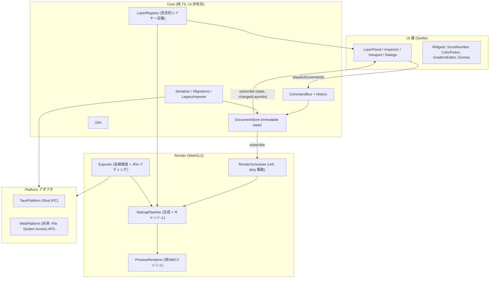

# 03. ソフトウェアアーキテクチャ

## 1. 設計原則

1. **コアは UI にもプラットフォームにも依存しない**：モデル、コマンド、レイヤー定義、レンダラーは Svelte にも Tauri にも依存しない純粋な TypeScript で書く。テストしやすく、Web 版や別のシェルにも移植できる。
2. **スキーマが唯一の情報源**：レイヤーのパラメータは 1 か所で宣言し、UI、保存、既定値、検証、uniform、i18n キーをそこから導く。
3. **状態はイミュータブル、変更はコマンドで行う**：すべての変更がコマンドを通ることで、Undo/Redo、自動保存、差分描画のきっかけが一元化される。
4. **ドキュメントとビューを分ける**：成果物（マットキャップ）に影響する状態と、見え方（プレビュー形状、ズーム、ノーマルマップ）を混ぜない。
5. **寛容な読み込み、厳密な書き出し**：現行の互換ルールを引き継ぐ。

## 2. レイヤー構成



## 3. ディレクトリ構成

```
matcap-maker/
├─ package.json / pnpm-lock.yaml / vite.config.ts / tsconfig.json
├─ src/
│  ├─ core/                      # UI 非依存
│  │  ├─ model/                  # Project, LayerNode, ViewState の型と生成関数
│  │  ├─ schema/                 # パラメータ型 p.float / p.color / p.direction ...
│  │  ├─ commands/               # Command 定義, CommandBus, History（まとめて 1 手にする処理）
│  │  ├─ layers/                 # レイヤー定義（1 レイヤー = .ts + .glsl）
│  │  │   ├─ spotLight.ts / spotLight.glsl
│  │  │   ├─ fresnel.ts / fresnel.glsl
│  │  │   └─ ...
│  │  ├─ io/                     # serialize, migrations, legacyV3Importer
│  │  └─ i18n/                   # en.json, ja.json, 型付きのキー
│  ├─ render/
│  │  ├─ gl/                     # 薄い WebGL2 ラッパー（Program, Texture, FBO プール）
│  │  ├─ pipeline/               # MatcapPipeline, LayerPass, FilterPass, 差分キャッシュ
│  │  ├─ shaders/                # common.glsl, blend.glsl, preview.*, jfa.*
│  │  ├─ preview/                # PreviewRenderer, meshes（sphere, obj/glb ローダー）
│  │  └─ export/                 # Exporter
│  ├─ platform/                  # Platform インターフェースと Tauri/Web 実装
│  └─ app/                       # Svelte UI
│     ├─ App.svelte, layout/
│     ├─ panels/                 # LayerPanel, Inspector, HistoryPanel, PresetBrowser
│     ├─ viewport/               # Viewport, gizmos/
│     ├─ widgets/                # ScrubNumber, ColorPicker, GradientEditor, CurveEditor
│     └─ dialogs/                # ExportDialog, Settings, About
├─ src-tauri/
│  ├─ tauri.conf.json
│  └─ src/  main.rs, commands/{project.rs, export.rs, settings.rs}, log.rs
├─ presets/                      # 同梱プリセット（.mcproj）
└─ tests/  core/*.test.ts, golden/*.spec.ts（Playwright）
```

## 4. データモデル

```ts
// ドキュメント（保存対象。成果物に影響するもの）
interface Project {
  schemaVersion: 1;
  meta: { name: string; createdWith: string; modifiedAt: string };
  settings: {
    blendSpace: 'srgb' | 'linear';        // 既定 'srgb'（現行・Photoshop と同じ見た目）
  };
  layers: LayerNode[];                    // 配列の先頭 = 最前面（UI の表示順と一致）
  assets: Record<AssetId, AssetMeta>;     // 画像などは ID で参照
}

interface LayerNode {
  id: string;                  // 安定した ID（UUID）。キャッシュと Undo のキー
  type: string;                // 'spotLight' など
  typeVersion: number;         // レイヤー定義ごとのマイグレーション用
  name: string;
  enabled: boolean;
  opacity: number;
  blendMode: BlendMode;
  params: Record<string, ParamValue>;
  mask?: MaskRef;              // 将来：マスク
  children?: LayerNode[];      // 将来：グループ
}

// ビュー状態（プロジェクトにも保存するが、Undo の対象外）
interface ViewState {
  previewShape: 'sphere' | 'flat' | 'mesh';
  split: 'single' | 'compare' | 'beforeAfter';
  normalMap?: { asset: AssetId; strength: number; scale: number; offset: [number, number] };
  mesh?: AssetId;
  zoom: number;
}
```

- **Base レイヤーの整理**：現行の Base レイヤーは「ベースカラー」と「ノーマルマップのプレビュー設定」を兼ねています。リメイク版では、前者を普通の **Solid Color レイヤー**に、後者を `ViewState.normalMap` に分けます。
- **並び順**：配列の先頭を最前面にし、一般的なペイントソフトと同じ直感に揃えます。描画時は逆順にたどります。
- **アセット**：パスは直接持たず `AssetId` で参照します。実体はプロジェクトファイル（zip）の中の `assets/` に置き、内容ハッシュで重複を省きます。

## 5. 宣言的なレイヤー定義

レイヤー 1 種類を「定義（TS）+ 評価関数（GLSL）」だけで表します。**レイヤーごとの描画コードや UI コードは書きません。**

```ts
// src/core/layers/spotLight.ts
export default defineLayer({
  type: 'spotLight',
  version: 1,
  kind: 'generator',                     // 'generator' | 'filter' | 'adjustment'
  category: 'light',
  defaults: { blendMode: 'add' },
  params: {
    direction: p.direction({ default: [0, 0, 1], gizmo: 'sphereHandle' }),
    color:     p.color({ default: '#ffffff' }),
    intensity: p.float({ default: 1, min: 0, max: 10, softMax: 2 }),
    range:     p.float({ default: 0.2, min: 0, max: 1 }),
    blur:      p.float({ default: 0.1, min: 0, max: 1 }),
    scale:     p.vec2({ default: [1, 1], min: 0.01, max: 4, linked: true }),
    rotation:  p.angle({ default: 0, gizmo: 'rotateRing' }),
  },
  shader: spotLightGlsl,                 // vec4 evalLayer(MatcapCtx ctx) を実装
  migrations: {},                        // { 1: (params) => params' } の形
});
```

```glsl
// src/core/layers/spotLight.glsl  — uniform はスキーマから自動生成（u_direction など）
vec4 evalLayer(MatcapCtx ctx) {
  vec3 d = normalize(u_direction);
  ...
  return vec4(u_color * u_intensity * falloff, falloff);
}
```

スキーマから自動で導くもの：

| 導出先 | 内容 |
|---|---|
| Inspector UI | パラメータの型から部品を選ぶ（float→ScrubSlider、color→ColorPicker、direction→方向球 + ビューポートのギズモ、gradient→GradientEditor） |
| GLSL | `uniform` 宣言の生成と、描画時の値の割り当て |
| シリアライズ | 既定値と異なる値だけを保存し、読み込み時に検証と範囲外の値の補正を行う |
| i18n | `layer.spotLight.param.intensity` の形のキーを自動で決める（翻訳がなければ英語にフォールバック） |
| マイグレーション | `typeVersion` を見て順に変換する |

`kind: 'filter'`（Blur / Sharpen など）は、評価関数の代わりに複数パス（`passes: [...]`）を宣言でき、入力として下のレイヤーまでの合成結果を受け取ります。

## 6. 状態管理とコマンド

```ts
interface Command { type: string; apply(draft: Project): void; label: I18nKey; mergeKey?: string; }
```

- `DocumentStore` は Immer（または Mutative）で状態を更新し、**patch と inverse patch** を作ります。History はこの patch の組を積み上げるだけなので、コマンドごとに undo を書く必要がありません。
- **スライダーのドラッグ**は `beginTransaction()` から `commit()` までを 1 手にまとめます。途中のプレビュー更新は行いつつ、履歴には 1 件だけ残します。
- 変更通知には `changedLayerIds` を付け、レンダラーが差分だけを描き直せるようにします（04 参照）。
- 自動保存：変更後 2 秒でデバウンスし、`%LOCALAPPDATA%/MatcapMaker/recovery/` にスナップショットを書き出します。正常に終了したら削除し、次回起動時に残っていれば復旧を提案します。

## 7. プロジェクトファイル形式

- 拡張子 `.mcproj`（zip）：`project.json` と `assets/<hash>.<ext>` と `thumbnail.png`
- `project.json` は人が読める JSON にし、`schemaVersion` を持たせます。
- 読み込みの順序：zip を展開 → `schemaVersion` のマイグレーション → レイヤーごとに `typeVersion` のマイグレーション → スキーマで検証（未知のパラメータは捨てる、欠けているものは既定値、未知のレイヤーはスキップして警告を表示）。
- **旧 v3 の `.json` のインポート**：`LegacyV3Importer` で型名、パラメータ名、並び順（逆転）、Base レイヤーの分割、画像パスのアセット取り込みを変換します。対応表は各レイヤー定義の `legacy` フィールドに書きます。

## 8. Platform インターフェース

```ts
interface Platform {
  openProject(): Promise<ProjectBundle | null>;
  saveProject(bundle: ProjectBundle, path?: string): Promise<string>;
  pickImage(): Promise<ImportedAsset | null>;
  writeImage(pixels: ArrayBuffer, spec: ImageSpec, path: string): Promise<void>; // Rust でエンコード
  settings: KeyValueStore;
  recovery: RecoveryStore;
}
```
Tauri 版は Rust のコマンドを呼びます。将来の Web 版は File System Access API と、WASM 版の PNG エンコーダで実装します。

## 9. エラー処理とログ
- フロントエンドの例外（`window.onerror` と `unhandledrejection`）は Rust のロガーへ送り、`%LOCALAPPDATA%/MatcapMaker/logs/` にローテーションしながら保存します。
- シェーダーのコンパイルに失敗した場合は、そのレイヤーだけを無効にしてバッジで知らせます。アプリは止めません。
- WebGL のコンテキストが失われた場合（`webglcontextlost`）は、GPU リソースをすべて作り直して復帰します。状態はコア側にあるので失われません。
