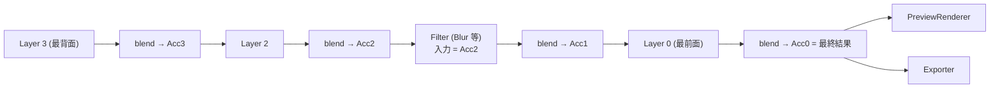
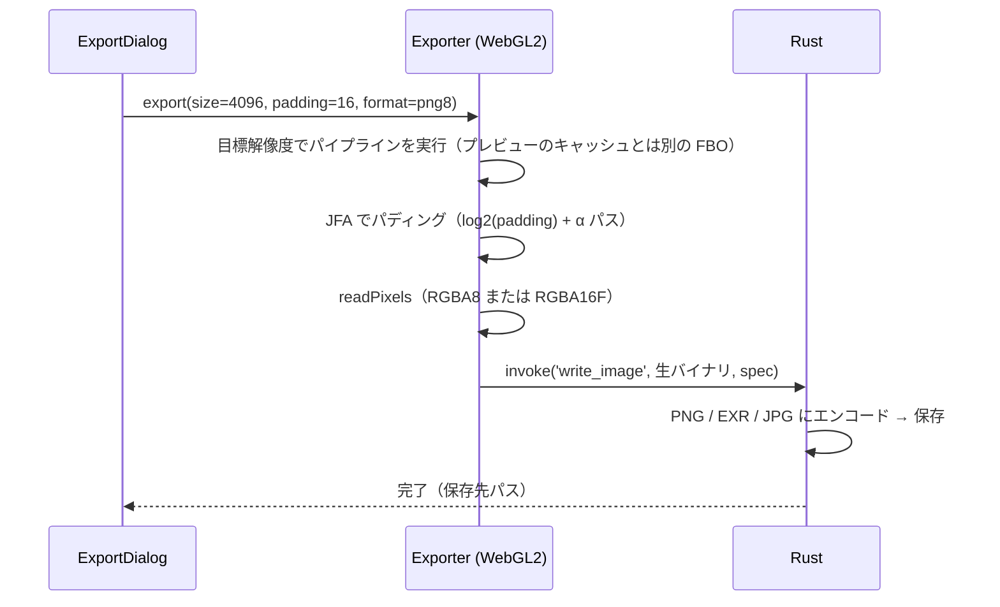

# 04. レンダリング設計

## 1. マットキャップ空間での生成

マットキャップは「ビュー空間での法線 → 色」の対応表です。そこで、**球体メッシュを描くのではなく、テクスチャ座標から法線を直接求めて**各レイヤーを評価します。

```
uv ∈ [0,1]²  →  p = uv*2-1  →  r² = |p|²
r² ≤ 1 のとき  n = (p.x, p.y, sqrt(1 - r²))   // 円盤の内側
r² > 1 のとき  円盤の外（アルファ 0。書き出し時はパディングの対象）
```

各レイヤーの GLSL は、共通のコンテキストを受け取る純粋な関数として書きます。

```glsl
struct MatcapCtx {
  vec2 uv;       // 0..1
  vec2 p;        // -1..1
  vec3 n;        // ビュー空間の法線
  float inside;  // 円盤マスク（輪郭はアンチエイリアス済み）
};
vec4 evalLayer(MatcapCtx ctx);   // straight alpha を返す
```

利点：
- すべてのパスがフルスクリーン quad 1 枚で済み、ジオメトリも深度も不要。
- **生成結果とプレビューが完全に独立する**ので、同じテクスチャを球体、ノーマルマップ付き球体、任意メッシュ、平面表示で使い回せる。
- エクスポートは「同じパイプラインを目標の解像度で実行する」だけで、プレビューと完全に一致する。

## 2. パイプライン



- **内部フォーマットは RGBA16F**：値が 1.0 を超えるハイライトもクリップされずに残り、将来の HDR/EXR 出力にもそのまま使える。8bit での表示と書き出しは最終段でクランプまたはトーンマップする。
- **ブレンドはシェーダー内の計算で行い、GL の固定機能は使わない**（現行と同じ考え方）。`blend.glsl` で 12 モードを `switch` で実装する。
  - 合成は straight alpha の Porter-Duff source-over とモード関数の組み合わせ（W3C Compositing Level 1 の式）。
  - `blendSpace = 'srgb'` の場合は、sRGB でエンコードした値に対してモード関数を適用する（現行や Photoshop と同じ見た目）。`'linear'` はより物理的な見た目になる。
- レイヤーの不透明度とマスクは、ブレンドパスでまとめて適用する。

## 3. 差分レンダリングとキャッシュ（軽さの要）

| 仕組み | 内容 |
|---|---|
| **累積結果のキャッシュ** | 各段の累積結果（Acc_k）を FBO プールに保持する。レイヤー k が変わったら、k から最前面までだけを再計算する。最前面のレイヤーを触っているときは 1〜2 パスで済む |
| **レイヤーごとのキャッシュ** | ジェネレーターの単体出力は `hash(params, 解像度)` をキーにキャッシュする。並び替えや不透明度・ブレンドモードの変更では、レイヤー自体は再評価せず再合成だけを行う |
| **dirty 駆動のスケジューラー** | `requestAnimationFrame` で動くが、dirty でなければ何もしない。アイドル時の CPU/GPU は 0 |
| **解像度を段階的に上げる** | ドラッグ中はプレビュー解像度を 512 に落とし、手を止めて 150ms 経ったら 1024（または表示サイズに合わせた解像度）で描き直す |
| **重いリソースの遅延生成** | ノイズの permutation テクスチャ、画像レイヤーのテクスチャやミップマップはパラメータが変わったときだけ作る |
| **サムネイル** | 各レイヤーの単体出力を 64px に縮小してレイヤーパネルに表示する。アイドル時にまとめて更新する |

メモリの目安：1024² × RGBA16F = 8MB/枚。20 レイヤー分の累積結果とレイヤーキャッシュを持っても 300MB 程度だが、上限を決めて LRU で捨てる（捨てたものは再計算するだけ）。

## 4. フィルタレイヤー（Blur / Sharpen など）

- 分離型ガウシアン（横パス → 縦パス）で、半径に応じてサンプル数を決め、線形フィルタを使ってタップ数を半分にする。
- **円盤の輪郭を広げない**：円盤マスクで重み付けし、正規化した畳み込み（`Σ w·a·c / Σ w·a`）を行ってから元のマスクを掛け直す。外の透明色が滲み込むのも防げる（現行の修正と同じ意図）。
- Sharpen はアンシャープマスク（`src + amount·(src − blur)`）。
- Color Adjustment は 1 パスの色変換（将来はカーブと LUT を追加）。

## 5. プレビュー

`PreviewRenderer` は最終結果のテクスチャを受け取り、ビュー設定に従って描くだけです。

| 形状 | 描き方 |
|---|---|
| 平面 | マットキャップのテクスチャをそのまま表示（円盤の外はチェッカー） |
| 球体 | 解析的な球（レイキャスト、またはフルスクリーン quad で法線を計算）→ 法線でテクスチャを参照 |
| ノーマルマップ付き球体 | 球の UV でノーマルマップを参照して接空間の法線を摂動し、同じ参照を行う。strength、scale、offset はビュー設定で持つ |
| 任意メッシュ（将来） | `.obj` / `.glb` を読み込み、ビュー空間の法線で参照。オービット操作 |

- 画面分割：`single` / `compare`（通常 | ノーマルマップ付き、現行の比較モードに相当）/ `beforeAfter`（選択レイヤーあり | なし を左右スワイプで比較）
- ギズモ（05 参照）はプレビューの上に重ねたオーバーレイ（SVG または 2D canvas）として描く。球上の点と `n` の変換は解析的に計算できる。

## 6. エクスポート



### 6.1 パディング：GPU の Jump Flooding Algorithm
- 現行の NumPy による反復処理（1px 広げるごとに 8 近傍）を、**GPU の JFA** に置き換える。
  1. シードパス：`alpha > 0` のピクセルに自分の座標を書き込む（RG16F/RG32F テクスチャ）
  2. ステップ幅 `k = 2^⌈log2(padding)⌉ … 1` で JFA を回す（4096² でも 1 パスあたり 1ms 未満）
  3. 解決パス：最寄りのシードまでの距離が `padding` 以下の穴は、そのシードの色で埋める
- 必要なら「近傍の平均」に近い見た目にするため、最後に 3×3 の平均化パスを 1 回かける（現行の出力との差をゴールデン画像で確認する）。
- 境界の半透明ピクセルの扱い（アルファのしきい値）はオプションにする。

### 6.2 巨大な解像度
- WebGL2 の `MAX_TEXTURE_SIZE` はデスクトップ GPU では通常 16384 なので、4096 は余裕で収まる。8192 以上が必要になった場合に備え、タイル分割でレンダリングできるようにしておく（各レイヤーが uv の関数なので分割は簡単。ただしブラーなどのフィルタはタイルの縁に余白が必要）。

### 6.3 出力形式
| 形式 | 用途 |
|---|---|
| PNG 8bit（straight alpha） | 既定。現行と互換 |
| PNG 16bit | バンディングを抑えたい場合 |
| JPG | 現行と互換（背景を指定色で塗りつぶす） |
| EXR 16F | 将来。HDR ワークフロー向け |
